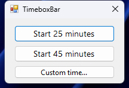
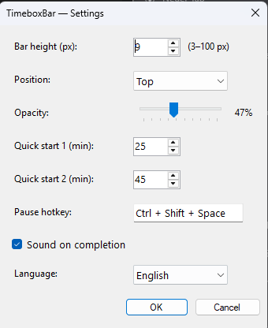

# TimeboxBar

A slim progress bar at the screen edge that counts down a timebox — fully click-through, zero screen space wasted.


## Why

Every timer app needs your attention. TimeboxBar lives at the top (or bottom) edge of your screen as a thin stripe. You see it in your peripheral vision while working, without ever switching focus.

Unlike browser extensions or floating windows, TimeboxBar is:
- **Click-through** — mouse clicks pass through the bar to whatever is behind it
- **System tray only** — no taskbar entry, no window
- **Always on top** — visible above all other apps
- **All virtual desktops** — the bar stays visible when you switch desktops

## Features

- Green → Yellow → Red color as time runs out
- Configurable bar height (3–100 px), position (top/bottom), and opacity
- Pause/Resume via configurable hotkey (default: Ctrl+Shift+Space)
- Quick-start presets (default: 25 min / 45 min) + custom time input
- Blink + sound on completion
- English and German UI (follows Windows language, override in Settings)
- Persists configuration across sessions

## Screenshots

### Quick start popup
Appears on launch and when the hotkey is pressed while no timer is running.



### Settings


## Download

Go to the [Releases page](../../releases) and download:

- **`TimeboxBar-*-Setup.exe`** — installer (recommended)
- **`TimeboxBar-*.zip`** — portable, just unzip and run

### Windows SmartScreen warning

Because the app is not code-signed, Windows may show a SmartScreen warning on first launch:

> Click **"More info"** → **"Run anyway"**

This is expected for unsigned open-source software. The source code is fully auditable here.

## Requirements

- Windows 10 / 11
- .NET Framework 4.8 (pre-installed on Windows 10/11)

## Build from source

```
git clone https://github.com/Numb006/TimeboxBar.git
cd TimeboxBar
msbuild TimeboxBar/TimeboxBar.csproj /p:Configuration=Release
```

Requires: Visual Studio 2022 or the [Build Tools for Visual Studio 2022](https://visualstudio.microsoft.com/downloads/).

### Run tests

```
msbuild TimeboxBar.Tests/TimeboxBar.Tests.csproj /p:Configuration=Release
packages\NUnit.ConsoleRunner.3.16.3\tools\nunit3-console.exe TimeboxBar.Tests\bin\Release\TimeboxBar.Tests.dll
```

## License

MIT — see [LICENSE](LICENSE)
